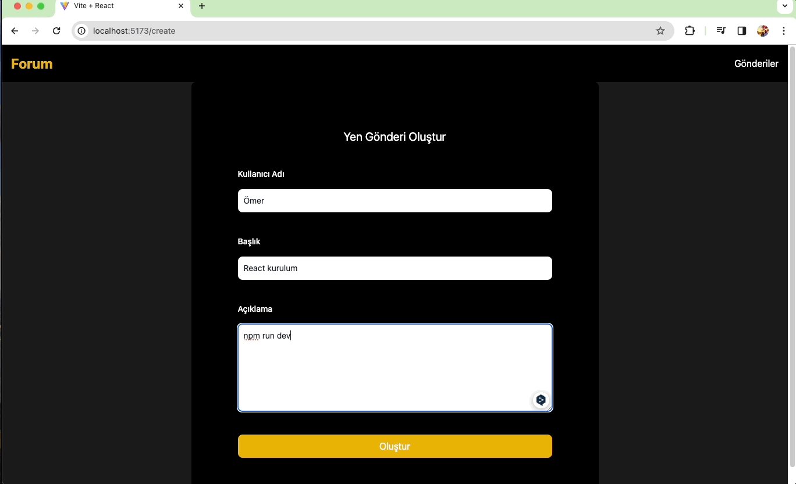

<h1>Forum Uygulaması</h1>

Bu proje, kullanıcıların gönderiler oluşturabileceği ve listelebileceği basit bir forum uygulamasıdır. Kullanıcılar gönderi oluşturabilir, mevcut gönderilere göz atabilir ve kullanıcılar arasında gönderi sahibine göre filtreleme yapabilir.

<h2>Özellikler</h2>

Kullanıcılar gönderi oluşturabilir ve gönderebilir.
Oluşturulan gönderiler listelenebilir.
Her gönderinin başlık ve içerik kısmı bulunmaktadır.
Kullanıcılar gönderiler arasında gezinebilir ve istedikleri gönderiyi seçebilir.
Kullanıcılar gönderi oluştururken kullanıcı adı, başlık ve içerik girmelidir.
Gönderiler kullanıcı adına göre filtrelenir ve seçilen kullanıcının gönderileri pop-up penceresinde görüntülenebilir.

<h2>Kullanılan Teknolojiler</h2>

React.js: Kullanıcı arayüzü oluşturmak için kullanılmıştır.
React Router: Sayfalar arası yönlendirme sağlamak için kullanılmıştır.
Axios: HTTP istekleri yapmak için kullanılmıştır.
Tailwind CSS: Hızlı ve basit bir şekilde CSS yazmak için kullanılmıştır.
React Toastify: Bildirimler için kullanılmıştır.

<h2>Ekran Görüntüsü</h2>

